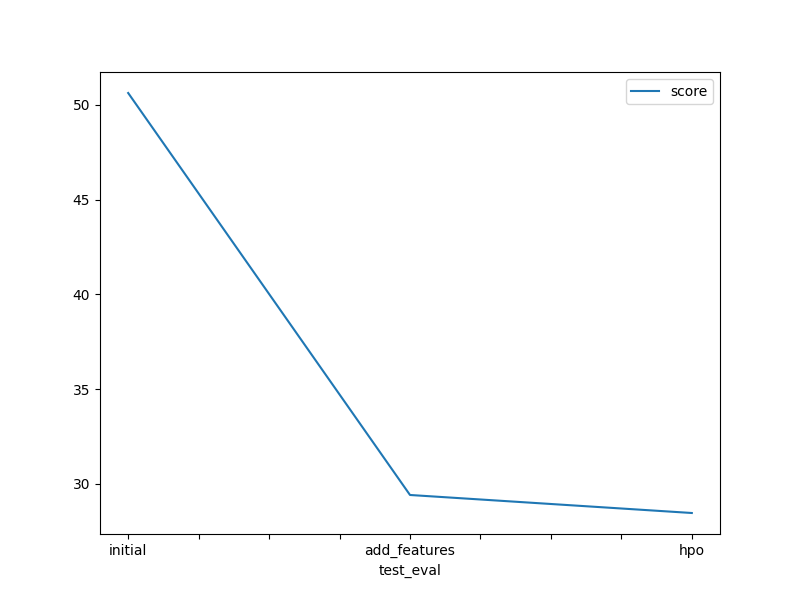
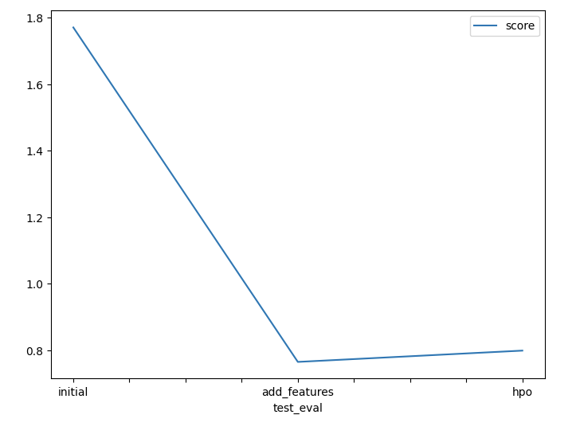

# Report: Predict Bike Sharing Demand with AutoGluon Solution
#### RODNEY MWANJE LUGUYESI

## Initial Training
### What did you realize when you tried to submit your predictions? What changes were needed to the output of the predictor to submit your results?
I submitted my results directly to through the web in Kaggle I did not use the cli tool and 
I wasn't required to make any changes to my data

### What was the top ranked model that performed?
WeightedEnsemble_L3 - it had a lower root mean squared error in all model trainings. 

## Exploratory data analysis and feature creation
### What did the exploratory analysis find and how did you add additional features?
With the exploratory data analysis I was able to see how most of the features data are 
distributed and this are some of the things.
I was able to note, the count which is our target variable is more skewed to the left 
hence our model might result to be biased when making predictions,
the holiday feature has two data points and most of them are the 1,
these are some of the observations I made from EDA.

I was able to add more features by splitting the datetime column into 
month, day, year.

### How much better did your model preform after adding additional features and why do you think that is?
After adding the above features my model improved significantly, before my best 
performing model had a r2 score of 50 and after adding more features the 
r2 score decreased to 29. The reason the model was able to improve significantly 
is because it had more data points that made predictions easier, it was able to understand
the datetime field more clearly.

## Hyper parameter tuning
### How much better did your model preform after trying different hyper parameters?
My model was improved but not with a great significant, the r2 score decreased from 
29 to 28, one of the parameters I changed was the time limit i allowed more time for
the model to train, I also changed auto_stack to True which when set to true
increases the predictive accuracy since AutoGluon relies on bagging and multi-layer
stack ensembling to boost predictive accuracy.

### If you were given more time with this dataset, where do you think you would spend more time?
Preprocessing and understanding my data, things like correlation of the features
and how each correlate to the target variable, with these I will be have a better
domain knowledge hence an advantage when training and chosing the model to use.

### Create a table with the models you ran, the hyperparameters modified, and the kaggle score.
|model|hpo1|hpo2|hpo3|score|
|--|--|--|--|--|
|initial|?|presets|time_limit|1.77097|
|add_features|?|presets|time_limit|0.76421|
|hpo|auto_stack|num_bag_sets|time_limit|0.79820|

### Create a line plot showing the top model score for the three (or more) training runs during the project.

### Create a line plot showing the top kaggle score for the three (or more) prediction submissions during the project.

## Summary
TODO: Add your explanation
